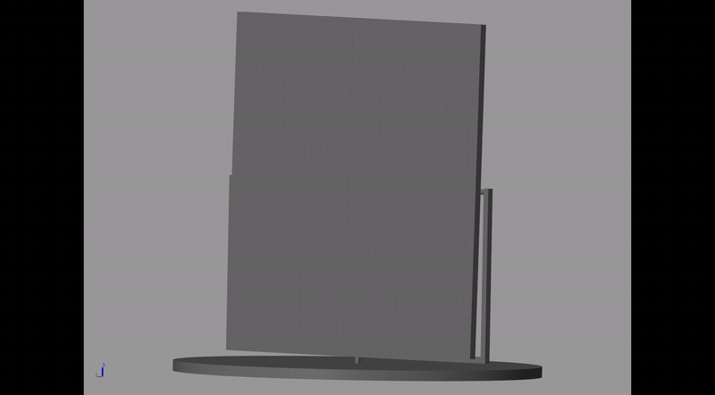
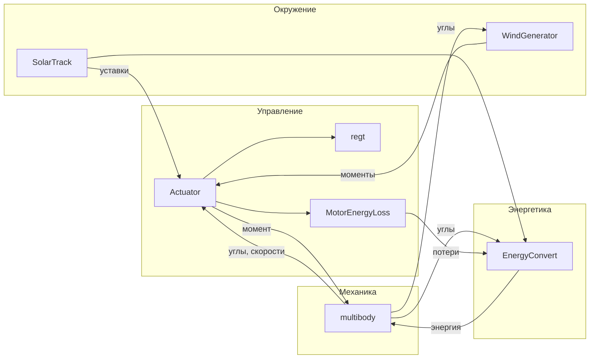

# SolarTrackerModel

Комплексная модель двухосевого солнечного трекера в MATLAB/Simulink. Проект объединяет 3D-механику на базе CAD-геометрии, модель электромеханического привода с редуктором, расчёт положения Солнца, ветровые нагрузки и оценку выработанной энергии с учётом точности наведения и потерь в приводах.

Модель собрана модульно: каждый физический аспект вынесен в отдельный `.slx`-файл и подключается в главную схему через Model Reference.

## Демонстрация

Запись симуляции из Mechanics Explorer — слежение за Солнцем, реакция на ветровую нагрузку, изменение ориентации панелей.



## Структура репозитория

```
SolarTrackerModel/
├── Diplomm.m              # параметры привода, редуктора и ветровой модели
├── multibody.slx          # главная интегрированная модель
├── Actuator.slx           # электромеханический привод одной оси
├── regt.slx               # дискретный регулятор
├── MotorEnergyLoss.slx    # расчёт потерь энергии в приводе
├── SolarTrack.slx         # положение Солнца на небе
├── WindGenerator.slx      # ветровая нагрузка
├── EnergyConvert.slx      # расчёт полученной энергии
├── docs/                  # материалы для README
│   └── simulation.gif     # запись симуляции
└── 3dmodel/               # CAD-геометрия
```

## Что реализовано

### `multibody.slx` — интегрированная модель

Центральная Simulink-модель, в которой связаны механика, управление и внешние воздействия.

- **Simscape Multibody** — трёхмерная динамика трекера с двумя степенями свободы: азимут и угол места
- **CAD-импорт** — геометрия и инерционные параметры загружаются из STEP-файлов (`3dmodel/`)
- **Два привода** — азимутальный и по углу места, каждый через `Actuator.slx`
- **Внешние воздействия** — солнечная траектория (`SolarTrack.slx`) и ветер (`WindGenerator.slx`)
- **Энергетический баланс** — интеграл полезной выработки с вычетом потерь приводов (`EnergyConvert.slx`)
- **Режимы работы** — автоматическое слежение за Солнцем и ручная подача уставок через переключатели
- **Визуализация** — Scope для углов ориентации и накопленной энергии

Решатель: `ode45`, время моделирования 0–250 с.

### `Actuator.slx` — электромеханический привод

Модель одной оси вращения. Используется дважды — для азимута и угла места.

- **Контур управления** — ошибка по углу, масштабирование и дискретный регулятор `regt.slx` (Ts = 0.01 с)
- **Модель ДПТ** — RL-цепь обмотки, ограничения по напряжению (±24 В) и току (±6.5 А), мёртвая зона «напряжения трогания» (±1.2 В), противо-ЭДС
- **Редуктор** (i = 619) — люфт (dead zone), нелинейное трение, MATLAB Function для определения контакта в зазоре
- **Обратная связь** — угол и скорость с механической части; внешний момент от ветра на входе
- **Выходы** — крутящий момент на шарнир Simscape, напряжение и ток для расчёта потерь

### `regt.slx` — дискретный регулятор

Дискретный компенсатор с периодом дискретизации 0.01 с. Структура — каскад блоков задержки и усиления, полученный в результате дискретизации непрерывной передаточной функции (см. закомментированный код синтеза в `Diplomm.m`).

### `SolarTrack.slx` — положение Солнца

Расчёт углов Солнца для заданного места наблюдения (широта 55°, долгота 37°, часовой пояс UTC+3).

- Склонение Солнца по номеру дня года
- Уравнение времени
- Часовой угол, зенитный угол, высота и азимут
- Ограничение видимости — обнуление угла, когда Солнце ниже горизонта

### `WindGenerator.slx` — ветровая нагрузка

Модель аэродинамического давления на солнечные панели.

- **Скорость ветра** — средняя составляющая, порывы и шум; ограничение 0–25 м/с
- **Направление** — медленные колебания по азимуту и углу места
- **Сила** — пропорциональна квадрату скорости ветра и косинусу угла между ориентацией панели и направлением потока; учитываются габариты панелей (`laz`, `lel`)
- **Выходы** — моменты `MvAz`, `MvEl`, подаваемые на соответствующие приводы

Профиль ветра задокументирован в чертеже `3dmodel/w(t).cdw`.

### `EnergyConvert.slx` — выработанная энергия

Оценка полезной энергии с учётом качества наведения.

- Ошибки ориентации относительно солнечных уставок: `epsAz`, `epsEl`
- КПД наведения: `cos(epsAz) × cos(epsEl)` с пороговым отсечением при больших ошибках
- Номинальная мощность панелей — 400 Вт
- Модель затенения (импульсное снижение освещённости)
- Интеграл: полезная энергия минус потери обоих приводов (`MotorEnergyLoss.slx`)

### `MotorEnergyLoss.slx` — потери в приводе

Расчёт энергозатрат на ориентацию: интеграл `|U · I|` по напряжению и току двигателя.

### `Diplomm.m` — параметры системы

Скрипт инициализации, загружающий в workspace параметры электродвигателя, редуктора и ветровой модели:

| Группа | Параметры |
|--------|-----------|
| Двигатель | `R`, `L`, `Km`, `Kw`, `J`, `Jd` |
| Редуктор | `i`, `c`, `a`, `b`, параметры трения `F1`, `F2`, `G1`, `G2`, `G` |
| Регулятор | `KPDr` |
| Ветер | `laz`, `lel` — характерные размеры панелей |

### `3dmodel/` — CAD-геометрия

## Связи между модулями



**Поток сигналов:**

1. `SolarTrack` формирует уставки азимута и угла места → `Actuator` (через переключатели режима)
2. `Actuator` выдаёт момент → шарниры Simscape Multibody → углы и скорости обратно в привод
3. `WindGenerator` получает текущую ориентацию и генерирует моменты нагрузки → `Actuator`
4. Углы, солнечные уставки и потери приводов → `EnergyConvert` → интеграл выработанной энергии

## Запуск

**Требования:** MATLAB R2025a (или совместимая версия) с Simulink, Simscape, Simscape Multibody.

1. Открыть проект в MATLAB
2. Выполнить `Diplomm.m` — загрузка параметров в workspace
3. Открыть `multibody.slx` и запустить симуляцию
4. Убедиться, что все Model Reference и STEP-файлы из `3dmodel/` доступны по относительным путям

## Инструменты

| Категория | Инструменты |
|-----------|-------------|
| Моделирование | MATLAB / Simulink, Simscape, Simscape Multibody |
| Управление | Дискретный компенсатор, ZOH-дискретизация |
| CAD | SolidWorks, KOMPAS-3D |